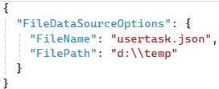

# Task Tracker CLI

Project Task URL: https://roadmap.sh/projects/task-tracker

This project is implemented by using .NET 8 Console App solution.

Task Tracker is a simple console-based application to help us to track and manage our tasks.

## Features

- Add a new task: task-cli add [task description]
- Update task: task-cli update [task id] [task description]
- Delete task: task-cli delete [task id]
- Mark in-progress: task-cli mark-in-progress [task id]
- Mark done: task-cli mark-done [task id]
- List all tasks: task-cli list
- List tasks by done status: task-cli list done
- List tasks by todo status: task-cli list todo
- list tasks by in-progress status: task-cli list in-progress

## Setup

Follow the below steps:

1. Clone this repository:
   ```bash
   git clone https://github.com/thangtnguyen/TaskTrackerCLI.git
   ```
2. Navigate to the TaskTrackerCLI directory:
   ```bash
   cd TaskTrackerCLI\task-cli
   ```
3. Update the appsettings.json file to configure the folder and file name of json file which stores task. The below is the example:
   

4. Build the project:
   ```bash
   dotnet build
   ```
5. Navigate to the bin\Debug\net8.0 to run the app to follow the above command in Features part. Data will be stored in json file and configured location which configured in appsettings.json in step 3.
